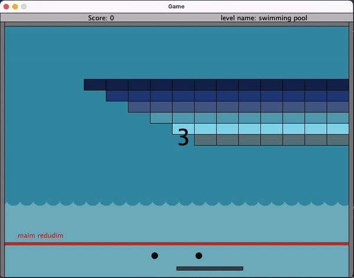
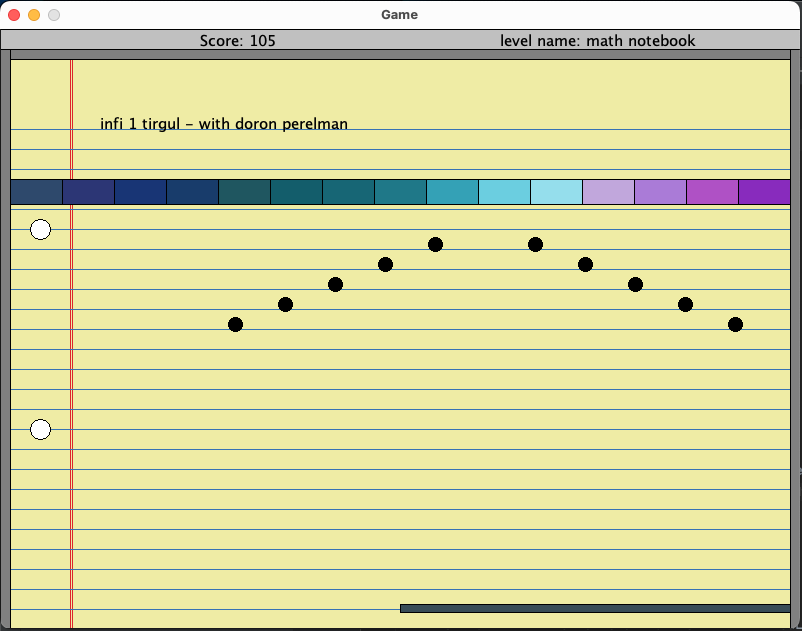
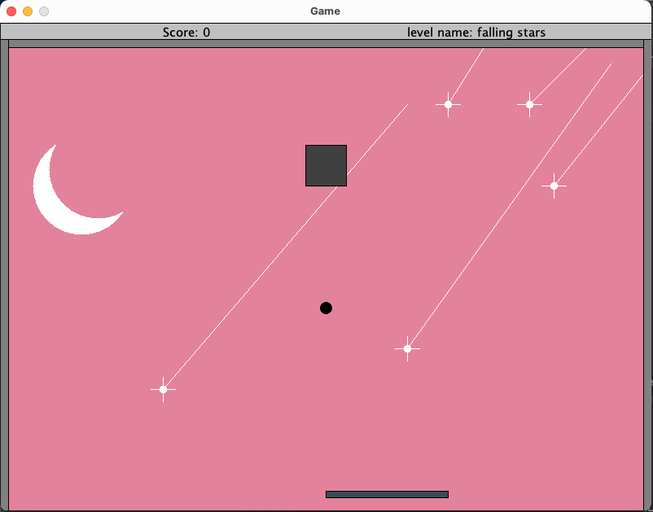
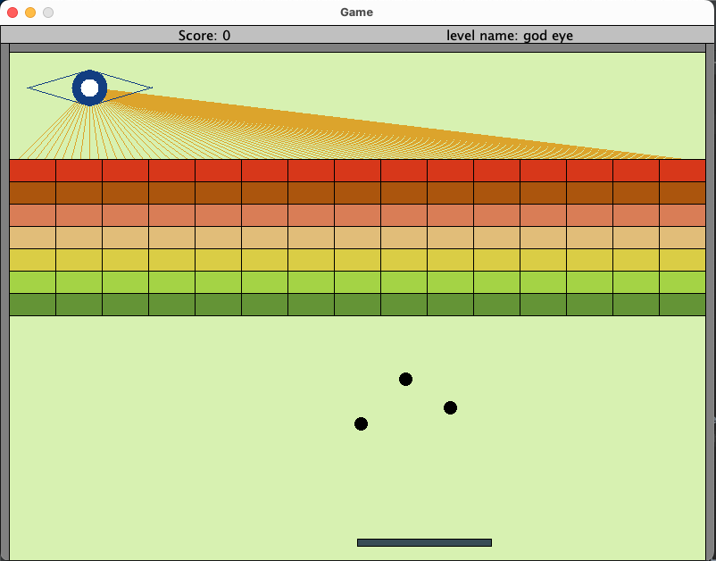
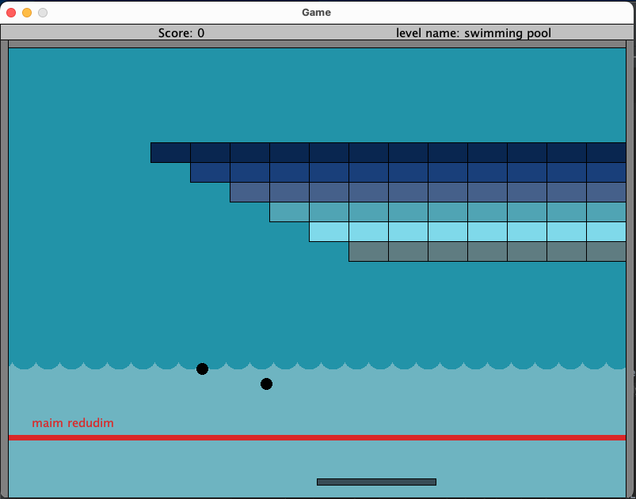

<p align="center">
  
</p>

<p align="center">
  
</p>


## Introduction

This Arkanoid version is the final product of Java OOP course, which I took in the 2nd semester of my 1st year at Bar Ilan University.  
This project was coded as a five-part ongoing assignment. Instead of using Java GUI Built-In objects, I used a GUI implementation which is included in this repository. The game contains various levels with increasing difficulty, and was coded while preserving generic and modularity, so adding new levels is an easy task.

The implementation includes:

💥 Polymorphism and inheritance.

💥 Usage of OOP design patterns, such as Decorator, Observer, Builder, etc.

💥 Usage of several generic collections data structures such as Linked Lists, Maps, etc.

💥 User-friendly GUI platform.

[UML Diagram of the project](https://drive.google.com/file/d/1JezIk3r2uw9hfBMqRUZ3FaLppEjuW2Y2/view?usp=sharing)

## Screenshots

<p align="left">
  
</p>

<p align="left">
  
</p>

<p align="left">
  
</p>

<p align="left">
  
</p>


## Installation


### Option 1 - Without Ant
1. Clone the repository:
    ```
    git clone https://github.com/YuvalKorenfeld/Arkanoid.git
    ```

2. Open the project from an IDE such as Intellij, Eclipse, etc.
3. Add the biu-oop.jar file as a global library to the Arkanoid project.
4. Make sure an updated JDK is set in the configuration, and the src folder of Arkanoid is set as the source root.
5. Create a configuration with Ass6.java as the Main Class, run it, and enjoy!


### Option 2 - With Ant
1. Clone the repository:
    ```
    git clone https://github.com/YuvalKorenfeld/Arkanoid.git
    ```
2. Install [Apache Ant](https://ant.apache.org/bindownload.cgi) 
 
   if you're having difficulties with the Ant installation proccess, you can click [here](https://www.youtube.com/watchv=3eaW81yYIqY&t=353s&ab_channel=xscourse) for help. 

<br /> 

3. Open CMD in the cloned directory and run this command:
    ```
    ant run
    ```

## Built With

- Java

<br />

## Author

**YuvalKorenfeld**
